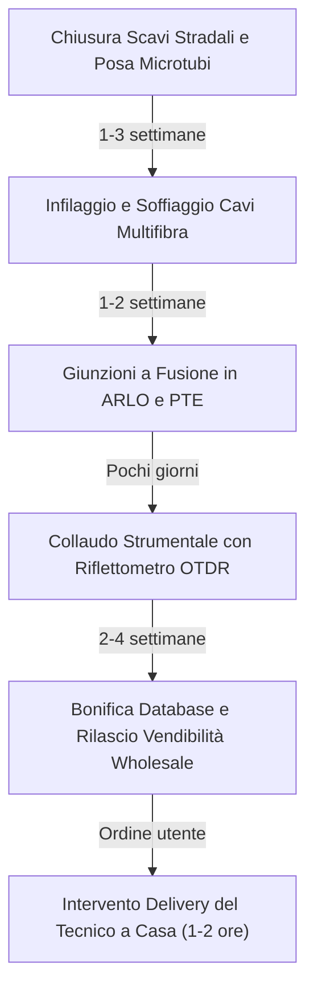

# Dalla Fine dei Lavori all'Attivazione della Linea

Molti cittadini si chiedono perché, una volta chiusi gli scavi stradali davanti al portone di casa, la fibra non risulti immediatamente attivabile sui siti dei gestori telefonici. Tra la fine dei lavori edili e la navigazione a 1 o 10 Gbps intercorre un percorso tecnico e informatico suddiviso in cinque tappe obbligate.

---

## 1. La Cronologia dei Tempi Post-Cantiere

---

## 2. Fase 1: Soffiaggio Cavi (*Air-Blown Fiber*)

Gli scavi in minitrincea non posano direttamente i filamenti in vetro, bensì fasci di **microdotti in polietilene ad alta densità (PE-HD)** cavi all'interno.
- Squadre di tecnici specializzati posizionano un compressore pneumatico a una delle estremità della tratta stradale.
- Il cavo multifibra viene "sparato" dentro il tubetto tramite getti d'aria ad alta pressione lubrificata con speciali emulsioni, galleggiando senza attrito per centinaia di metri fino a raggiungere l'armadio ARLO o il pozzetto di destinazione.

---

## 3. Fase 2: Giunzioni e Posa del PTE/ROE Condominiale

I singoli tubetti secondari vengono fatti entrare nel condominio o fissati alla facciata esterna:
- Il tecnico installa il box plastico del **PTE** (*Punto di Terminazione d'Edificio*).
- Tramite la giuntatrice ad arco voltaico vengono saldate le fibre in arrivo dalla strada ai connettori SC/APC dello splitter del fabbricato.

---

## 4. Fase 3: Il Collaudo Ottico Strumentale (OTDR & OPM)

Prima di poter dichiarare collaudata la linea, le squadre eseguono due misurazioni strumentali certificate:

1. **Misura di Potenza con OPM (*Optical Power Meter*):**
   Un generatore laser in centrale trasmette un segnale calibrato. All'armadio ARLO e a ciascun PTE il tecnico misura la potenza ricevuta (espressa in dBm). La potenza deve rientrare nella finestra utile stabilita dal capitolato (tipicamente tra **-15 dBm e -25 dBm**).
2. **Tracciatura Riflettometrica OTDR (*Optical Time Domain Reflectometer*):**
   L'OTDR invia impulsi luminosi ultrabrevi lungo la fibra e rileva la retrodiffusione di Rayleigh e le riflessioni di Fresnel. Lo strumento disegna un grafico cartesiano che mostra:
   - La lunghezza fisica esatta della tratta in metri.
   - La posizione millimetrica di ogni giunzione e la relativa attenuazione in dB.
   - Eventuali microcurvature (*macrobending*) che disperdono luce a 1550 o 1625 nm.

Se un giunto presenta una perdita anomala (> 0,1 dB), la squadra è tenuta ad aprire nuovamente la muffola o l'armadio e rieseguire la fusione prima di rilasciare il certificato di collaudo.

---

## 5. Fase 4: Bonifica Database e Vendibilità Wholesale

Superato il collaudo sul campo:
- I file di collaudo vengono caricati sui sistemi gestionali dell'operatore di rete (*Wholesale Portal*).
- Ogni numero civico ed eventuale subalterno catastale associato all'area di influenza di quel PTE viene registrato nei database geografici con lo stato **"Attivo / Vendibile"**.
- I dati vengono sincronizzati nei listini informatici che alimentano i siti dei vari operatori retail (TIM, Vodafone, Fastweb, Iliad, WindTre, operatori locali).
- Da questo momento l'utente, inserendo il proprio indirizzo sui siti di verifica copertura, vedrà apparire il riscontro positivo per la tecnologia FTTH.

---

## 6. Fase 5: L'Intervento di Attivazione (*Delivery*)

Quando il cittadino sottoscrive il contratto, l'operatore wholesale invia una coppia di tecnici a domicilio (intervento gratuito nella posa standard):

1. **Passaggio nel montante condominiale:** Utilizzando una sonda tiracavi flessibile, il tecnico infila un cavetto monofibra antifiamma (LSZH) bianco o grigio dal PTE condominiale attraverso le canaline esistenti (di norma sfruttando i tubi del vecchio impianto telefonico) fino all'interno dell'appartamento.
2. **Fissaggio della Borchia Ottica:** A parete, vicino alla prima presa telefonica o dove richiesto dall'utente, viene installata la **borchia ottica** (una scatolina bianca di 8x8 cm con presa verde SC/APC).
3. **Misura e Certificazione Segnale:** Prima del collegamento finale, il tecnico innesta il misuratore portatile verificando che la potenza ottica sia ottimale (tipicamente attorno a -18 dBm).
4. **Allaccio dell'ONT:** La borchia viene collegata con una bretella ottica protetta all'**ONT** (*Optical Network Terminal*), che può essere un apparato indipendente alimentato a parete o un modulo SFP estraibile innestato direttamente nel modem/router.
5. **Accensione e Allineamento:** L'ONT aggancia il segnale laser, la spia *PON* (o *Optical*) diventa verde fissa e la navigazione a piena velocità è operativa.
